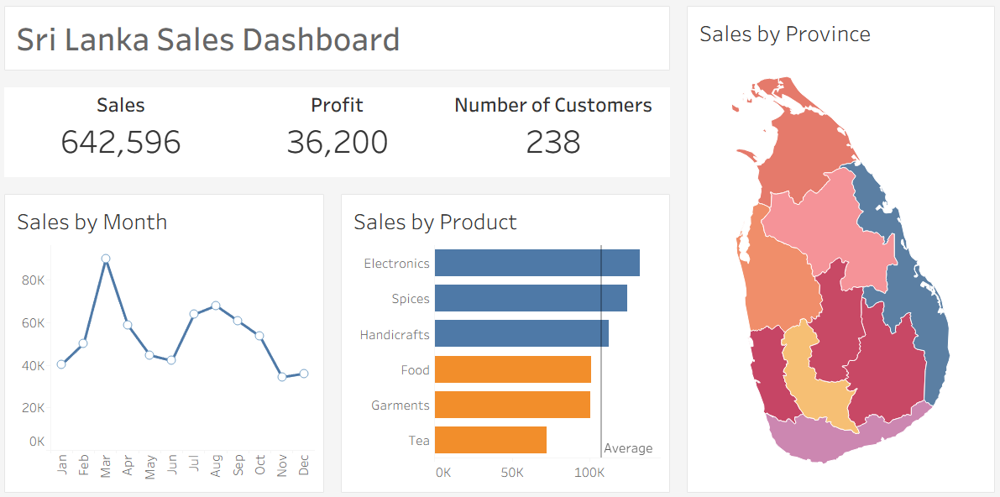

# 📊 Sri Lanka Sales & Profit Dashboard Tableau

  
  
  

---

## 📌 Project Overview  
This project demonstrates an end-to-end **sales and profit analysis** where I created a **synthetic dataset (~1000 rows)** to simulate business transactions, performed initial cleaning in **Excel**, and built an interactive dashboard in **Tableau**.  

The dashboard helps analyze **sales performance, profitability, product performance, and regional sales trends** across Sri Lanka.  

---

## 📁 Dataset  
- **Source:** *Self-created synthetic dataset (~1000 rows)*  
- **File:** `Sales_Profit_Data.xlsx`  
- **Description:** Transaction-level dataset including order details, customers, products, and sales metrics.  

**Columns include:**  
`Order_ID, Order_Date, Customer_ID, Country, Product_Category, Product_Name, Quantity, Sales, Discount, Profit`  

---

## 📂 Project Structure  

---

## ⚙️ Tools & Skills  
- **Excel** → Data creation & cleaning  
- **Tableau Public** → Interactive dashboarding, filters, KPI cards, maps  
- **Visualization Skills** → Sales trend analysis, product performance, regional sales distribution  

---

## 📊 Dashboard Features  
✅ **KPI Cards**: Total Sales, Total Profit, Number of Customers  
✅ **Line Chart**: Sales trend by month  
✅ **Bar Chart**: Sales by product category  
✅ **Map**: Sales by province (Sri Lanka)  
✅ **Interactivity**: Filters by Date, Province, Product Category  

---

## 📸 Screenshots  

  

---

## 🔑 Key Insights  
- Western province contributes the **highest share of sales**  
- Some categories have **high sales but low profit margins**  
- Monthly trend highlights **seasonal sales fluctuations**  
- Unique customer count provides insight into **engagement levels**  

---

## 🚀 How to Use  
1. Open `Data/Sales_Profit_Data.xlsx` to explore raw data.  
2. Open `Tableau/SriLanka_Sales_Profit_Dashboard.twbx` in Tableau Public/Desktop.  
3. Use filters (Date, Province, Product Category) to explore insights.  

---

## ✍️ Author  
**Harshana Suraweera**  
🔗 [LinkedIn](#) | 🌐 [GitHub](#)  

---

